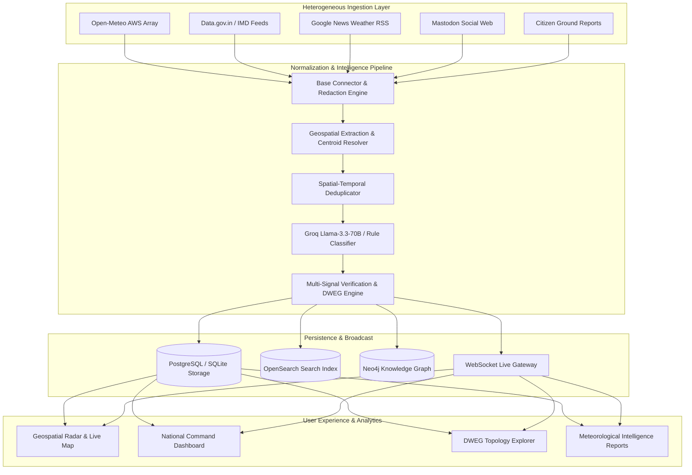

# SkyPulse

### Scalable National Weather Big Data Analytics Platform for India

[](LICENSE)
[](docs/TESTING.md)
[](https://www.typescriptlang.org/)
[](https://react.dev/)
[](https://fastapi.tiangolo.com/)
[](https://www.python.org/)

SkyPulse is a **National Weather Big Data & Evidence Intelligence Platform** engineered to aggregate, normalize, verify, deduplicate, and analyze heterogeneous meteorological signals across India in real time.

---

## Overview

India faces frequent, high-impact meteorological events — torrential monsoon downpours, severe cyclones, extreme heatwaves, dust squalls, and mountain cloudbursts. Ground truth information is fragmented across:
- **Government Sensor Networks** (IMD AWS mesonet feeds, state automatic weather stations)
- **Public Weather APIs** (Open-Meteo, satellite reanalysis)
- **News Media Outlets** (Regional news RSS feeds, weather alert bulletins)
- **Decentralized Social Web** (Mastodon weather community observations, `#mumbairains`, `#delhiweather`)
- **Citizen Ground Truth** (Crowdsourced field reports with geo-tagged images)

SkyPulse ingests these disparate feeds, extracts spatial and meteorological entities, performs spatial-temporal clustering and multi-signal verification against automated weather stations, and delivers an explainable, real-time national situational awareness platform.

---

## Key Capabilities

- **Multi-Source Ingestion Engine**: Continuous ingestion from Open-Meteo, Data.gov.in IMD feeds, Google News RSS, Mastodon decentralized social web, and citizen crowdsourced reports.
- **AI-Assisted Verification & Intelligence**: Groq Llama-3.3-70B pipeline with deterministic rule-based fallback for instant hazard categorization, impact narratives, and evidence reasoning.
- **Dynamic Weather Evidence Graph (DWEG)**: Topological knowledge graph linking Weather Events, Evidence Reports, Sources, and Geographic Entities with explainable provenance chains.
- **Spatial-Temporal Deduplication**: Automated clustering of multi-channel reports into canonical weather events using Haversine spatial proximity ($\le 45\text{ km}$) and temporal sliding windows ($\le 6\text{ hours}$).
- **Interactive Geospatial Radar**: High-performance Google Maps interface displaying 240+ observation stations, 75+ nationwide hazard events, multi-horizon time filters (`1H`, `6H`, `24H`, `7D`, `ALL`), and full dossier inspection drawers.
- **Live Real-Time Synchronization**: Sub-second WebSocket streaming (`/ws/events`) for instant event creation, state updates, and alert propagation.
- **Comprehensive Analytics & Reporting**: Real-time severity distributions, category breakdowns, source reliability scoring, and PDF/printable meteorological reports.

---

## Architecture



---

## Technology Stack

### Frontend
- **Framework**: React 18 (TypeScript)
- **Build Tool**: Vite
- **Mapping & GIS**: `@vis.gl/react-google-maps` (Google Maps JavaScript API)
- **Charts & Visualizations**: Recharts
- **State Management**: Zustand
- **Icons & Styling**: Lucide React, Vanilla CSS Design System with dark glassmorphism

### Backend
- **Framework**: FastAPI (Python 3.11)
- **Data Validation**: Pydantic v2
- **ORM & Migrations**: SQLAlchemy 2.0, Alembic
- **Asynchronous Engine**: asyncio, aiohttp, httpx, uvicorn

### Data & AI Services
- **Database**: PostgreSQL 16 + PostGIS / SQLite (local development)
- **Graph Database**: Neo4j 5 Community Edition (DWEG)
- **Search & Indexing**: OpenSearch 2.11
- **Caching & Pub/Sub**: Redis 7
- **AI/LLM Provider**: Groq API (Llama-3.3-70B-Versatile) with zero-latency deterministic rule fallback

---

## Quickstart & Local Development

### 1. Prerequisites
- **Node.js**: `v18.0.0+`
- **Python**: `3.11.x`
- **npm** or **yarn**

### 2. Backend Setup
```bash
cd backend
python -m venv .venv

# Activate virtual environment
# Windows:
.venv\Scripts\Activate.ps1
# Linux/macOS:
source .venv/bin/activate

pip install -r requirements.txt
cp .env.example .env
alembic upgrade head
uvicorn app.main:app --host 0.0.0.0 --port 8000 --reload
```
API Documentation: `http://localhost:8000/docs`

### 3. Frontend Setup
```bash
cd frontend
npm install
cp .env.example .env.local
npm run dev
```
Frontend Web Application: `http://localhost:3000/`

---

## Testing & Quality Assurance

SkyPulse maintains a comprehensive test suite across frontend and backend modules:

```bash
# Run Frontend Tests (108 tests passing)
cd frontend
npm test

# Run Frontend Production Build Check
npm run build

# Run Backend Unit Tests
cd backend
pytest tests/
```

See [`docs/TESTING.md`](docs/TESTING.md) for test execution details and coverage reports.

---

## Project Structure

```text
SkyPulse/
├── README.md                          # Project overview and documentation index
├── LICENSE                            # MIT License
├── CONTRIBUTING.md                   # Contribution guidelines and coding standards
├── CODE_OF_CONDUCT.md                 # Contributor covenant code of conduct
├── SECURITY.md                        # Security policy and vulnerability disclosure
├── .gitignore                         # Comprehensive Git ignore definitions
├── .env.example                       # Root environment variables template
├── docker-compose.yml                 # Local multi-service infrastructure compose
├── docker-compose.prod.yml            # Production deployment compose manifest
│
├── docs/                              # Comprehensive documentation suite
│   ├── PRD.md                         # Product requirements document
│   ├── SYSTEM_ARCHITECTURE.md         # System architecture specification
│   ├── DATABASE_SCHEMA.md             # Database schema and ER diagrams
│   ├── API_SPECIFICATION.md           # REST & WebSocket API specification
│   ├── AI_ML.md                       # AI/ML intelligence & verification architecture
│   ├── DATA_PIPELINE.md               # Ingestion, normalization, and deduplication
│   ├── DATA_SOURCES.md                # Ingestion connector catalog
│   ├── UI_UX.md                       # Design system and layout specification
│   ├── DEPLOYMENT.md                  # Cloud Run & Docker deployment guide
│   ├── DEVELOPMENT.md                 # Local setup and developer guide
│   ├── TESTING.md                     # Test strategy and test suites
│   ├── TROUBLESHOOTING.md             # Common issues and resolutions
│   └── IMPLEMENTATION_PLAN.md         # Architecture milestones and roadmap
│
├── frontend/                          # React + TypeScript + Vite web application
│   ├── src/
│   │   ├── components/                # Map, Events, DWEG, Layout, and UI components
│   │   ├── pages/                     # Dashboard, LiveMap, Events, Reports, Analytics, etc.
│   │   ├── store/                     # Zustand state stores (eventsStore, filtersStore)
│   │   ├── utils/                     # API client, WebSocket client, demo data layer
│   │   └── __tests__/                 # Vitest component and integration tests
│   ├── package.json
│   └── vite.config.ts
│
├── backend/                           # FastAPI Python backend application
│   ├── app/                           # Core API routes, schemas, models, and services
│   ├── ai/                            # Groq provider, fallback provider, confidence engine
│   ├── connectors/                    # Ingestion connectors (Open-Meteo, GNews, Mastodon)
│   ├── alembic/                       # Database schema migrations
│   └── requirements.txt
│
└── scripts/                           # Database seeding and utility scripts
```

---

## Documentation Index

| Document | Description |
|---|---|
| [**Product Requirements (PRD)**](docs/PRD.md) | Problem statement, functional requirements, and personas |
| [**System Architecture**](docs/SYSTEM_ARCHITECTURE.md) | High-level component interactions, data flow, and layers |
| [**Database Schema**](docs/DATABASE_SCHEMA.md) | Data models, relationships, indexes, and ER diagram |
| [**API Specification**](docs/API_SPECIFICATION.md) | Complete REST API routes and WebSocket protocols |
| [**AI & ML System**](docs/AI_ML.md) | Groq Llama-3.3-70B, confidence scoring, and fallbacks |
| [**Data Ingestion Pipeline**](docs/DATA_PIPELINE.md) | Signal collection, normalization, and spatial resolution |
| [**Data Sources Catalog**](docs/DATA_SOURCES.md) | Inventory of implemented telemetry feeds and connectors |
| [**UI / UX Design System**](docs/UI_UX.md) | Visual design tokens, 70/30 layout, and components |
| [**Deployment Guide**](docs/DEPLOYMENT.md) | Docker, Google Cloud Run, and Cloudflare Pages setup |
| [**Developer Guide**](docs/DEVELOPMENT.md) | Local environment configuration and setup instructions |
| [**Testing Suite**](docs/TESTING.md) | Vitest, pytest, integration tests, and test matrix |
| [**Troubleshooting & FAQ**](docs/TROUBLESHOOTING.md) | Solutions to common setup, key, and network errors |
| [**Implementation Plan**](docs/IMPLEMENTATION_PLAN.md) | Roadmap milestones and component deliverables |

---

## License

This project is licensed under the **MIT License** — see the [LICENSE](LICENSE) file for details.
