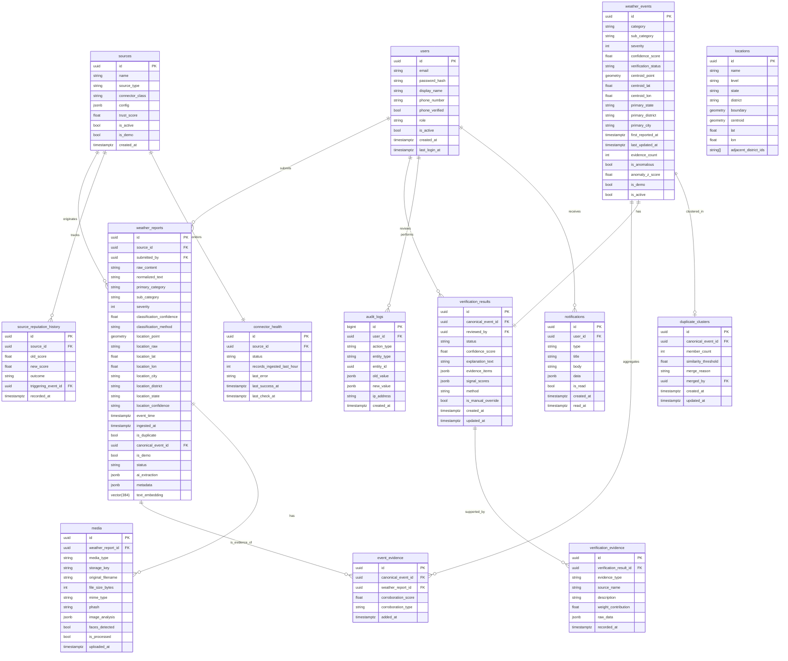

# SkyPulse — Database Schema

**Version:** 1.0  
**Database:** PostgreSQL 16 + PostGIS 3.4 + pgvector  
**Status:** Implementation-Ready

---

## Design Principles

1. All timestamps stored as `TIMESTAMPTZ` (UTC)
2. All geographic coordinates stored as PostGIS `GEOMETRY(Point, 4326)` 
3. UUIDs as primary keys (v4) for all public-facing entities
4. Soft deletes where data must be retained; hard deletes only for ephemeral data
5. Table partitioning on high-volume tables by created date
6. `audit_logs` is insert-only; no updates or deletes permitted
7. `pgvector` extension for embedding storage and similarity search

---

## Extensions Required

```sql
CREATE EXTENSION IF NOT EXISTS "uuid-ossp";
CREATE EXTENSION IF NOT EXISTS postgis;
CREATE EXTENSION IF NOT EXISTS pgvector;
CREATE EXTENSION IF NOT EXISTS pg_trgm;
```

---

## ER Diagram



---

## Table Definitions

### `users`

```sql
CREATE TABLE users (
    id                UUID PRIMARY KEY DEFAULT uuid_generate_v4(),
    email             VARCHAR(255) UNIQUE NOT NULL,
    password_hash     VARCHAR(255),                         -- NULL for OAuth users
    display_name      VARCHAR(100) NOT NULL,
    phone_number      VARCHAR(20),
    phone_verified    BOOLEAN NOT NULL DEFAULT FALSE,
    role              VARCHAR(20) NOT NULL DEFAULT 'CITIZEN'
                      CHECK (role IN ('PUBLIC','CITIZEN','ANALYST','ADMIN','GOVERNMENT')),
    is_active         BOOLEAN NOT NULL DEFAULT TRUE,
    is_anonymous      BOOLEAN NOT NULL DEFAULT FALSE,
    created_at        TIMESTAMPTZ NOT NULL DEFAULT NOW(),
    updated_at        TIMESTAMPTZ NOT NULL DEFAULT NOW(),
    last_login_at     TIMESTAMPTZ
);

CREATE INDEX idx_users_email ON users(email);
CREATE INDEX idx_users_role ON users(role);
```

### `sources`

```sql
CREATE TABLE sources (
    id               UUID PRIMARY KEY DEFAULT uuid_generate_v4(),
    name             VARCHAR(200) NOT NULL,
    description      TEXT,
    source_type      VARCHAR(30) NOT NULL
                     CHECK (source_type IN ('WEATHER_API','PUBLIC_DATASET','RSS_FEED',
                                            'CITIZEN','GOVERNMENT_API','DEMO')),
    connector_class  VARCHAR(100) NOT NULL,
    config           JSONB NOT NULL DEFAULT '{}',           -- Connector-specific config (no secrets)
    trust_score      FLOAT NOT NULL DEFAULT 0.5
                     CHECK (trust_score BETWEEN 0.0 AND 1.0),
    is_active        BOOLEAN NOT NULL DEFAULT TRUE,
    is_demo          BOOLEAN NOT NULL DEFAULT FALSE,
    created_at       TIMESTAMPTZ NOT NULL DEFAULT NOW(),
    updated_at       TIMESTAMPTZ NOT NULL DEFAULT NOW()
);

CREATE INDEX idx_sources_type ON sources(source_type);
CREATE INDEX idx_sources_active ON sources(is_active);
```

### `source_reputation_history`

```sql
CREATE TABLE source_reputation_history (
    id                   UUID PRIMARY KEY DEFAULT uuid_generate_v4(),
    source_id            UUID NOT NULL REFERENCES sources(id),
    old_score            FLOAT NOT NULL,
    new_score            FLOAT NOT NULL,
    outcome              VARCHAR(20) NOT NULL
                         CHECK (outcome IN ('VERIFIED','LIKELY','UNVERIFIED','CONTRADICTED','REQUIRES_REVIEW')),
    triggering_event_id  UUID,                              -- FK to weather_events
    recorded_at          TIMESTAMPTZ NOT NULL DEFAULT NOW()
);

CREATE INDEX idx_src_rep_source ON source_reputation_history(source_id);
CREATE INDEX idx_src_rep_recorded ON source_reputation_history(recorded_at DESC);
```

### `weather_reports`

```sql
CREATE TABLE weather_reports (
    id                      UUID NOT NULL DEFAULT uuid_generate_v4(),
    source_id               UUID NOT NULL REFERENCES sources(id),
    submitted_by            UUID REFERENCES users(id),      -- NULL for automated connectors
    
    -- Raw content
    raw_content             TEXT,
    normalized_text         TEXT,
    
    -- AI Classification
    primary_category        VARCHAR(30)
                            CHECK (primary_category IN (
                                'RAINFALL','THUNDERSTORM','FLOODING','HEATWAVE',
                                'FOG','DUST_STORM','STRONG_WINDS','UNKNOWN'
                            )),
    sub_category            VARCHAR(50),
    severity                SMALLINT CHECK (severity BETWEEN 1 AND 4),
    classification_confidence FLOAT CHECK (classification_confidence BETWEEN 0 AND 1),
    classification_method   VARCHAR(50),                    -- 'llm'|'zero_shot'|'rule_based'|'manual'
    
    -- Location
    location_point          GEOMETRY(Point, 4326),
    location_raw            TEXT,                           -- Original location string
    location_lat            DOUBLE PRECISION,
    location_lon            DOUBLE PRECISION,
    location_city           VARCHAR(100),
    location_district       VARCHAR(100),
    location_state          VARCHAR(100),
    location_confidence     VARCHAR(10)
                            CHECK (location_confidence IN ('HIGH','MEDIUM','LOW')),
    
    -- Timing
    event_time              TIMESTAMPTZ,                    -- When event occurred
    ingested_at             TIMESTAMPTZ NOT NULL DEFAULT NOW(),
    
    -- Deduplication
    is_duplicate            BOOLEAN NOT NULL DEFAULT FALSE,
    canonical_event_id      UUID,                           -- FK to weather_events
    
    -- Status
    status                  VARCHAR(20) NOT NULL DEFAULT 'PENDING'
                            CHECK (status IN ('PENDING','PROCESSING','PROCESSED','FAILED','FLAGGED')),
    
    -- Flags
    is_demo                 BOOLEAN NOT NULL DEFAULT FALSE,
    is_deleted              BOOLEAN NOT NULL DEFAULT FALSE,
    
    -- AI extraction result (structured)
    ai_extraction           JSONB,
    metadata                JSONB NOT NULL DEFAULT '{}',
    
    -- Embedding for similarity search
    text_embedding          vector(384),
    
    PRIMARY KEY (id, ingested_at)
) PARTITION BY RANGE (ingested_at);

-- Monthly partitions (create for current + next 12 months at startup)
CREATE TABLE weather_reports_2026_09 PARTITION OF weather_reports
    FOR VALUES FROM ('2026-09-01') TO ('2026-10-01');
CREATE TABLE weather_reports_2026_10 PARTITION OF weather_reports
    FOR VALUES FROM ('2026-10-01') TO ('2026-11-01');
-- ... (migration script creates partitions dynamically)

CREATE INDEX idx_wr_source ON weather_reports(source_id);
CREATE INDEX idx_wr_canonical ON weather_reports(canonical_event_id) WHERE canonical_event_id IS NOT NULL;
CREATE INDEX idx_wr_category ON weather_reports(primary_category);
CREATE INDEX idx_wr_state ON weather_reports(location_state);
CREATE INDEX idx_wr_district ON weather_reports(location_district);
CREATE INDEX idx_wr_event_time ON weather_reports(event_time DESC);
CREATE INDEX idx_wr_ingested ON weather_reports(ingested_at DESC);
CREATE INDEX idx_wr_status ON weather_reports(status);
CREATE INDEX idx_wr_location ON weather_reports USING GIST(location_point);
CREATE INDEX idx_wr_embedding ON weather_reports USING ivfflat(text_embedding vector_cosine_ops) WITH (lists = 100);
```

### `weather_events`

```sql
CREATE TABLE weather_events (
    id                  UUID PRIMARY KEY DEFAULT uuid_generate_v4(),
    category            VARCHAR(30) NOT NULL
                        CHECK (category IN (
                            'RAINFALL','THUNDERSTORM','FLOODING','HEATWAVE',
                            'FOG','DUST_STORM','STRONG_WINDS','UNKNOWN'
                        )),
    sub_category        VARCHAR(50),
    severity            SMALLINT NOT NULL DEFAULT 1 CHECK (severity BETWEEN 1 AND 4),
    confidence_score    FLOAT NOT NULL DEFAULT 0.5
                        CHECK (confidence_score BETWEEN 0 AND 1),
    verification_status VARCHAR(20) NOT NULL DEFAULT 'UNVERIFIED'
                        CHECK (verification_status IN (
                            'VERIFIED','LIKELY','UNVERIFIED','CONTRADICTED','REQUIRES_REVIEW'
                        )),
    
    -- Location (computed centroid of all evidence reports)
    centroid_point      GEOMETRY(Point, 4326),
    centroid_lat        DOUBLE PRECISION,
    centroid_lon        DOUBLE PRECISION,
    primary_state       VARCHAR(100),
    primary_district    VARCHAR(100),
    primary_city        VARCHAR(100),
    
    -- Temporal
    first_reported_at   TIMESTAMPTZ NOT NULL,
    last_updated_at     TIMESTAMPTZ NOT NULL DEFAULT NOW(),
    resolved_at         TIMESTAMPTZ,                        -- NULL = still active
    
    -- Evidence
    evidence_count      INT NOT NULL DEFAULT 1,
    
    -- Anomaly
    is_anomalous        BOOLEAN NOT NULL DEFAULT FALSE,
    anomaly_z_score     FLOAT,
    
    -- Flags
    is_demo             BOOLEAN NOT NULL DEFAULT FALSE,
    is_active           BOOLEAN NOT NULL DEFAULT TRUE,
    is_deleted          BOOLEAN NOT NULL DEFAULT FALSE,
    
    -- DWEG
    dweg_node_id        VARCHAR(100),                       -- Neo4j node ID reference
    
    created_at          TIMESTAMPTZ NOT NULL DEFAULT NOW(),
    updated_at          TIMESTAMPTZ NOT NULL DEFAULT NOW()
);

CREATE INDEX idx_we_category ON weather_events(category);
CREATE INDEX idx_we_status ON weather_events(verification_status);
CREATE INDEX idx_we_state ON weather_events(primary_state);
CREATE INDEX idx_we_district ON weather_events(primary_district);
CREATE INDEX idx_we_active ON weather_events(is_active) WHERE is_active = TRUE;
CREATE INDEX idx_we_first_reported ON weather_events(first_reported_at DESC);
CREATE INDEX idx_we_centroid ON weather_events USING GIST(centroid_point);
CREATE INDEX idx_we_severity ON weather_events(severity DESC);
```

### `event_evidence`

```sql
CREATE TABLE event_evidence (
    id                  UUID PRIMARY KEY DEFAULT uuid_generate_v4(),
    canonical_event_id  UUID NOT NULL REFERENCES weather_events(id),
    weather_report_id   UUID NOT NULL,                      -- Partitioned table; no FK constraint
    corroboration_score FLOAT NOT NULL DEFAULT 1.0
                        CHECK (corroboration_score BETWEEN 0 AND 1),
    corroboration_type  VARCHAR(20) NOT NULL DEFAULT 'PRIMARY'
                        CHECK (corroboration_type IN ('PRIMARY','CORROBORATING','CONTRADICTING')),
    added_at            TIMESTAMPTZ NOT NULL DEFAULT NOW()
);

CREATE UNIQUE INDEX idx_ee_unique ON event_evidence(canonical_event_id, weather_report_id);
CREATE INDEX idx_ee_event ON event_evidence(canonical_event_id);
CREATE INDEX idx_ee_report ON event_evidence(weather_report_id);
```

### `media`

```sql
CREATE TABLE media (
    id                  UUID PRIMARY KEY DEFAULT uuid_generate_v4(),
    weather_report_id   UUID NOT NULL,                      -- Partitioned table; no FK constraint
    media_type          VARCHAR(10) NOT NULL CHECK (media_type IN ('IMAGE','VIDEO','AUDIO')),
    storage_key         VARCHAR(500) NOT NULL,              -- MinIO/S3 object key
    storage_bucket      VARCHAR(100) NOT NULL DEFAULT 'skypulse-media',
    original_filename   VARCHAR(255),
    file_size_bytes     BIGINT,
    mime_type           VARCHAR(100),
    
    -- Image analysis
    phash               VARCHAR(64),                        -- Perceptual hash for deduplication
    image_analysis      JSONB,                              -- CLIP output
    faces_detected      BOOLEAN NOT NULL DEFAULT FALSE,
    is_blurry           BOOLEAN,
    
    -- Processing
    is_processed        BOOLEAN NOT NULL DEFAULT FALSE,
    processing_error    TEXT,
    
    uploaded_at         TIMESTAMPTZ NOT NULL DEFAULT NOW()
);

CREATE INDEX idx_media_report ON media(weather_report_id);
CREATE INDEX idx_media_phash ON media(phash) WHERE phash IS NOT NULL;
CREATE INDEX idx_media_type ON media(media_type);
```

### `locations`

```sql
CREATE TABLE locations (
    id                  UUID PRIMARY KEY DEFAULT uuid_generate_v4(),
    name                VARCHAR(200) NOT NULL,
    level               VARCHAR(10) NOT NULL CHECK (level IN ('CITY','DISTRICT','STATE','COUNTRY')),
    state               VARCHAR(100),
    district            VARCHAR(100),
    country             VARCHAR(10) NOT NULL DEFAULT 'IN',
    
    -- Geometry
    boundary            GEOMETRY(MultiPolygon, 4326),
    centroid            GEOMETRY(Point, 4326),
    lat                 DOUBLE PRECISION,
    lon                 DOUBLE PRECISION,
    
    -- Adjacency (pre-computed from boundary intersection)
    adjacent_location_ids  UUID[] NOT NULL DEFAULT '{}',
    
    created_at          TIMESTAMPTZ NOT NULL DEFAULT NOW()
);

CREATE INDEX idx_loc_level ON locations(level);
CREATE INDEX idx_loc_state ON locations(state);
CREATE INDEX idx_loc_boundary ON locations USING GIST(boundary);
CREATE INDEX idx_loc_centroid ON locations USING GIST(centroid);
CREATE INDEX idx_loc_name_trgm ON locations USING GIN(name gin_trgm_ops);
```

### `verification_results`

```sql
CREATE TABLE verification_results (
    id                  UUID PRIMARY KEY DEFAULT uuid_generate_v4(),
    canonical_event_id  UUID NOT NULL REFERENCES weather_events(id) UNIQUE,
    reviewed_by         UUID REFERENCES users(id),          -- NULL = AI only
    
    status              VARCHAR(20) NOT NULL
                        CHECK (status IN ('VERIFIED','LIKELY','UNVERIFIED','CONTRADICTED','REQUIRES_REVIEW')),
    confidence_score    FLOAT NOT NULL DEFAULT 0.5
                        CHECK (confidence_score BETWEEN 0 AND 1),
    explanation_text    TEXT NOT NULL,
    evidence_items      JSONB NOT NULL DEFAULT '[]',
    signal_scores       JSONB NOT NULL DEFAULT '{}',
    
    method              VARCHAR(20) NOT NULL DEFAULT 'AI'
                        CHECK (method IN ('AI','MANUAL','AI_CONFIRMED')),
    is_manual_override  BOOLEAN NOT NULL DEFAULT FALSE,
    manual_reason       TEXT,
    
    created_at          TIMESTAMPTZ NOT NULL DEFAULT NOW(),
    updated_at          TIMESTAMPTZ NOT NULL DEFAULT NOW()
);

CREATE INDEX idx_vr_event ON verification_results(canonical_event_id);
CREATE INDEX idx_vr_status ON verification_results(status);
CREATE INDEX idx_vr_reviewed_by ON verification_results(reviewed_by) WHERE reviewed_by IS NOT NULL;
```

### `verification_evidence`

```sql
CREATE TABLE verification_evidence (
    id                      UUID PRIMARY KEY DEFAULT uuid_generate_v4(),
    verification_result_id  UUID NOT NULL REFERENCES verification_results(id),
    evidence_type           VARCHAR(30) NOT NULL
                            CHECK (evidence_type IN (
                                'OFFICIAL_API','NEARBY_REPORT','SOURCE_TRUST',
                                'IMAGE_ANALYSIS','TEMPORAL_CONSISTENCY',
                                'HISTORICAL_BASELINE','ANALYST_NOTE'
                            )),
    source_name             VARCHAR(200),
    description             TEXT NOT NULL,
    weight_contribution     FLOAT,
    raw_data                JSONB,
    recorded_at             TIMESTAMPTZ NOT NULL DEFAULT NOW()
);

CREATE INDEX idx_ve_result ON verification_evidence(verification_result_id);
```

### `duplicate_clusters`

```sql
CREATE TABLE duplicate_clusters (
    id                  UUID PRIMARY KEY DEFAULT uuid_generate_v4(),
    canonical_event_id  UUID NOT NULL REFERENCES weather_events(id) UNIQUE,
    member_count        INT NOT NULL DEFAULT 1,
    similarity_threshold FLOAT NOT NULL DEFAULT 0.75,
    
    -- Manual operations
    was_split           BOOLEAN NOT NULL DEFAULT FALSE,
    was_merged          BOOLEAN NOT NULL DEFAULT FALSE,
    merge_reason        TEXT,
    merged_by           UUID REFERENCES users(id),
    
    created_at          TIMESTAMPTZ NOT NULL DEFAULT NOW(),
    updated_at          TIMESTAMPTZ NOT NULL DEFAULT NOW()
);
```

### `notifications`

```sql
CREATE TABLE notifications (
    id          UUID PRIMARY KEY DEFAULT uuid_generate_v4(),
    user_id     UUID NOT NULL REFERENCES users(id),
    type        VARCHAR(50) NOT NULL
                CHECK (type IN (
                    'NEW_HIGH_SEVERITY_EVENT','REPORT_VERIFIED','REPORT_REJECTED',
                    'DWEG_PROPAGATION_ALERT','CONNECTOR_DOWN','QUEUE_DEPTH_ALERT',
                    'ASSIGNED_FOR_REVIEW','SYSTEM_HEALTH'
                )),
    title       VARCHAR(200) NOT NULL,
    body        TEXT NOT NULL,
    data        JSONB NOT NULL DEFAULT '{}',             -- Type-specific payload
    is_read     BOOLEAN NOT NULL DEFAULT FALSE,
    created_at  TIMESTAMPTZ NOT NULL DEFAULT NOW(),
    read_at     TIMESTAMPTZ
);

CREATE INDEX idx_notif_user ON notifications(user_id);
CREATE INDEX idx_notif_unread ON notifications(user_id, is_read) WHERE is_read = FALSE;
CREATE INDEX idx_notif_created ON notifications(created_at DESC);
```

### `audit_logs`

```sql
CREATE TABLE audit_logs (
    id          BIGSERIAL NOT NULL,
    user_id     UUID REFERENCES users(id),
    action_type VARCHAR(50) NOT NULL
                CHECK (action_type IN (
                    'CREATE','UPDATE','DELETE','LOGIN','LOGOUT','VERIFY',
                    'REJECT','MERGE_CLUSTER','SPLIT_CLUSTER','CONNECTOR_ENABLE',
                    'CONNECTOR_DISABLE','ROLE_CHANGE','EXPORT'
                )),
    entity_type VARCHAR(50) NOT NULL,
    entity_id   UUID,
    old_value   JSONB,
    new_value   JSONB,
    ip_address  INET,
    user_agent  TEXT,
    created_at  TIMESTAMPTZ NOT NULL DEFAULT NOW(),
    
    PRIMARY KEY (id, created_at)
) PARTITION BY RANGE (created_at);

-- Quarterly partitions
CREATE TABLE audit_logs_2026_q4 PARTITION OF audit_logs
    FOR VALUES FROM ('2026-10-01') TO ('2027-01-01');

CREATE INDEX idx_audit_user ON audit_logs(user_id);
CREATE INDEX idx_audit_entity ON audit_logs(entity_type, entity_id);
CREATE INDEX idx_audit_created ON audit_logs(created_at DESC);
CREATE INDEX idx_audit_action ON audit_logs(action_type);
```

### `connector_health`

```sql
CREATE TABLE connector_health (
    id                          UUID PRIMARY KEY DEFAULT uuid_generate_v4(),
    source_id                   UUID NOT NULL REFERENCES sources(id) UNIQUE,
    status                      VARCHAR(20) NOT NULL DEFAULT 'UNKNOWN'
                                CHECK (status IN ('HEALTHY','DEGRADED','DOWN','UNKNOWN')),
    records_ingested_last_hour  INT NOT NULL DEFAULT 0,
    last_error                  TEXT,
    last_error_at               TIMESTAMPTZ,
    last_success_at             TIMESTAMPTZ,
    last_check_at               TIMESTAMPTZ NOT NULL DEFAULT NOW(),
    consecutive_failures        INT NOT NULL DEFAULT 0
);
```

---

## Partitioning Strategy

| Table | Partition Key | Strategy | Partition Size |
|---|---|---|---|
| `weather_reports` | `ingested_at` | RANGE by month | Monthly |
| `audit_logs` | `created_at` | RANGE by quarter | Quarterly |

New partitions are created automatically by the `scripts/migrate.py` script run monthly.

---

## Retention Strategy

| Table | Retention | Policy |
|---|---|---|
| `weather_reports` | 5 years | Archive to cold storage after 1 year; partition drop after 5 years |
| `weather_events` | Indefinite | No automatic deletion |
| `audit_logs` | 2 years mandatory | Drop oldest partition after 2 years |
| `notifications` | 90 days | Cron job deletes read notifications older than 90 days |
| `connector_health` | Rolling | Single row per connector; no history kept (see `source_reputation_history`) |
| `media` | 2 years | MinIO lifecycle policy; metadata row retained after file deletion |

---

## Key Indexes Summary

| Index | Table | Columns | Type | Purpose |
|---|---|---|---|---|
| Spatial | `weather_reports` | `location_point` | GIST | Bounding box / radius queries |
| Spatial | `weather_events` | `centroid_point` | GIST | Map clustering |
| Spatial | `locations` | `boundary` | GIST | Location lookup |
| Vector | `weather_reports` | `text_embedding` | IVFFlat | Similarity search for dedup |
| Trigram | `locations` | `name` | GIN | Autocomplete / fuzzy search |
| Composite | `weather_reports` | `(primary_category, ingested_at)` | BTree | Dashboard category filter |
| Composite | `weather_reports` | `(location_state, ingested_at)` | BTree | State filter |

---

## OpenSearch Index Mapping

```json
{
  "index": "weather_reports",
  "mappings": {
    "properties": {
      "id": {"type": "keyword"},
      "normalized_text": {"type": "text", "analyzer": "standard"},
      "primary_category": {"type": "keyword"},
      "severity": {"type": "integer"},
      "location_state": {"type": "keyword"},
      "location_district": {"type": "keyword"},
      "location_city": {"type": "keyword"},
      "location_point": {"type": "geo_point"},
      "event_time": {"type": "date"},
      "ingested_at": {"type": "date"},
      "verification_status": {"type": "keyword"},
      "confidence_score": {"type": "float"},
      "source_type": {"type": "keyword"},
      "is_demo": {"type": "boolean"}
    }
  }
}
```
