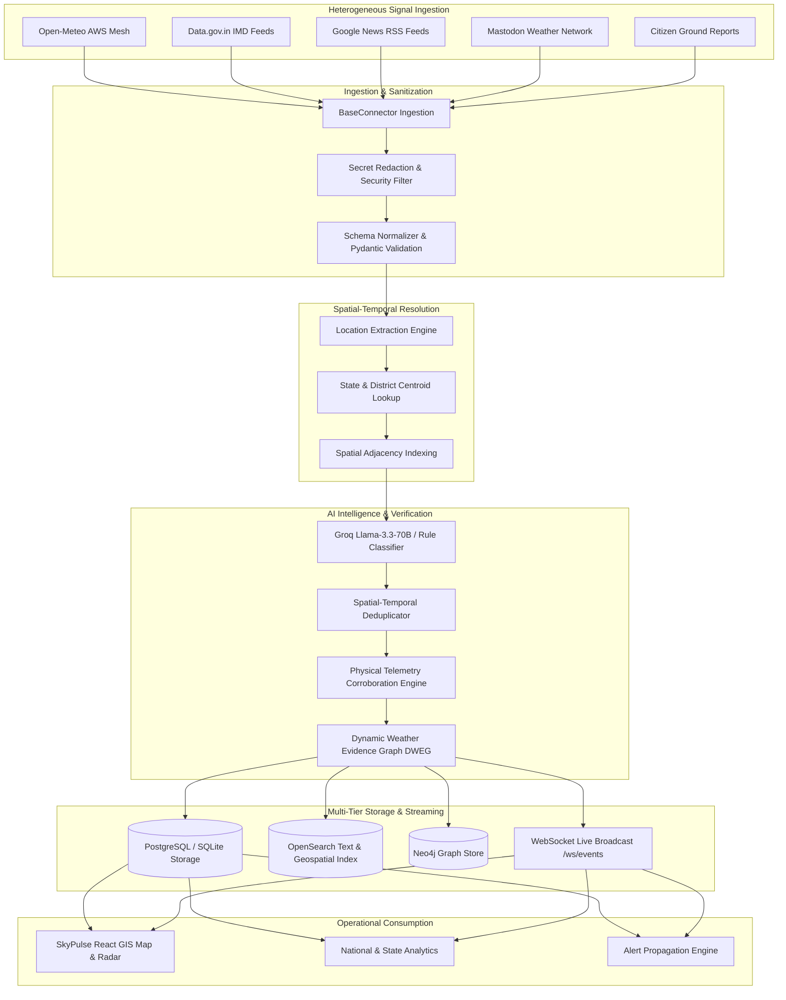

# SkyPulse Data Ingestion & Processing Pipeline

## 1. Pipeline Overview

The SkyPulse data pipeline ingests heterogeneous, high-volume meteorological signals across India, normalizes unstructured and structured payloads, extracts geographic entities, deduplicates incoming reports into canonical weather events, verifies claims against physical telemetry, and powers real-time alerts.

---

## 2. Stage-by-Stage Processing Architecture

### Stage 1: Source Discovery & Polling
- **Workers**: Asynchronous polling workers (`backend/connectors/`) orchestrate rate-limited requests to external APIs and web feeds.
- **Connectors**:
  - `OpenMeteoConnector`: Polls hourly surface observations (temperature, humidity, precipitation, wind speed, pressure) across hundreds of district coordinates.
  - `DataGovConnector`: Ingests official IMD datasets from api.data.gov.in.
  - `NewsWebsiteConnector`: Aggregates news headlines and articles via Google News RSS for weather hazards.
  - `SocialWebConnector`: Searches Mastodon feeds for hyper-local hashtags (`#mumbairains`, `#delhiweather`, `#chennairains`, `#bengalururains`).
  - `ReportService`: Handles direct citizen crowdsourced submissions with media attachments.

### Stage 2: Schema Normalization & Sanitization
- **Pydantic Validation**: Payload is converted to `RawReportSchema` with mandatory UTC timestamps, ISO strings, and standard floating-point telemetry.
- **Redaction Engine**: Filters and scrubs embedded API keys, tokens, session IDs, and private user identifiers before database persistence.

### Stage 3: Geospatial & Entity Extraction
- **Location Extraction**: Textual reports are scanned against Indian States (28 states, 8 UTs) and 700+ District Gazettes.
- **Centroid & Bounding Box**: When GPS coordinates are not provided by the source, the centroid and district bounding box are assigned.
- **Spatial Resolution**: Categorizes resolution as `EXACT_POINT`, `CITY`, `DISTRICT`, or `STATE`.

### Stage 4: Deduplication & Canonical Event Clustering
- **Clustering Rule**: Reports occurring within:
  1. **Spatial radius**: ≤ 45 km
  2. **Temporal window**: ≤ 6 hours
  3. **Phenomenon similarity**: Same meteorological category (e.g. `FLOODING`, `HEATWAVE`, `THUNDERSTORM`)
- **Canonical Weather Event**: Grouped into a single canonical `WeatherEvent` (`EVT-...`), updating signal counts, evidence arrays, and confidence tiers (`MODERATE`, `HIGH`, `VERY HIGH`).

### Stage 5: Multi-Signal Verification & AI Engine
- **Telemetry Corroboration**: Cross-references report claims against nearby automated weather station (AWS) observations.
- **Status Determination**:
  - `VERIFIED`: Multiple independent sources or ground sensor corroboration (Confidence $\ge 0.70$).
  - `LIKELY`: Single high-credibility publisher with corroborating regional signals ($0.50 \le \text{Confidence} < 0.70$).
  - `UNVERIFIED`: Single uncorroborated report awaiting telemetry corroboration ($\text{Confidence} < 0.50$).
  - `CONTRADICTED`: Ground station telemetry contradicts the reported condition.
- **AI Intelligence**: Summaries, impact narratives, and hazard classifications are produced via Groq Llama-3.3-70B with instantaneous rule-based fallback.

### Stage 6: Graph & Search Indexing
- **DWEG Knowledge Graph**: Ingested entities are linked in Neo4j (`EVT` $\xrightarrow{\text{LOCATED\_AT}}$ `LOC`, `REP` $\xrightarrow{\text{CORROBORATES}}$ `EVT`, `SRC` $\xrightarrow{\text{PUBLISHED}}$ `REP`).
- **OpenSearch Indexing**: Full-text descriptions and vector embeddings are indexed for semantic similarity search.

### Stage 7: Real-Time Broadcast & REST APIs
- **WebSocket Gateway**: Dispatches event creations and updates over `wss://.../ws/events`.
- **REST Endpoints**: Serves geojson `/api/v1/map/features`, paginated `/api/v1/events`, and analytics `/api/v1/metrics/national`.
