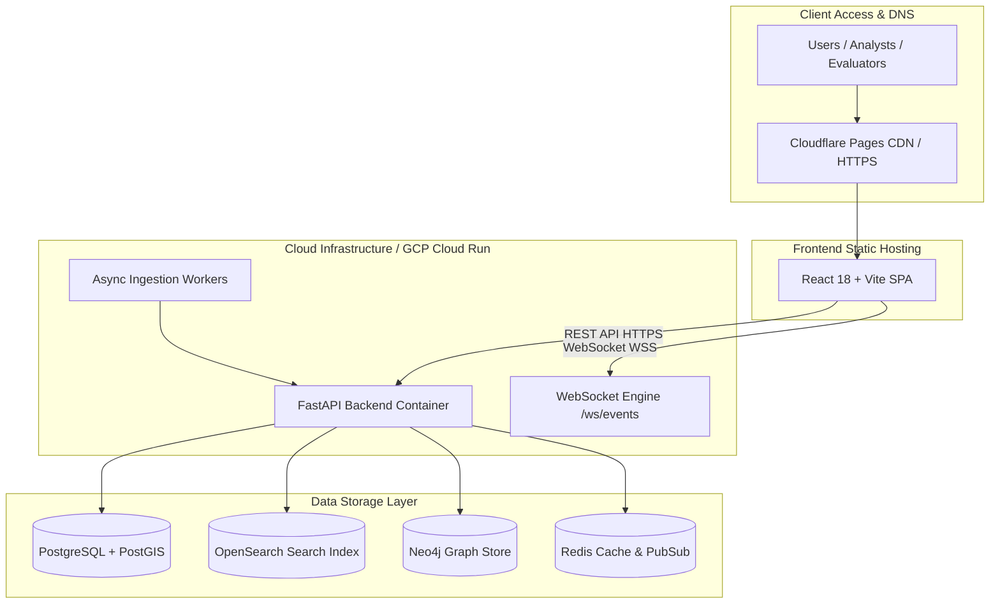

# SkyPulse Deployment Guide

This document outlines deployment architectures, containerization workflows, environment configurations, and production runbooks for SkyPulse.

---

## 1. Deployment Architecture



---

## 2. Docker Compose Deployment (Self-Hosted / Staging)

SkyPulse provides Docker Compose manifests for multi-service local or VM deployment:

### Full Stack Deployment
```bash
# Clone the repository
git clone https://github.com/alokkumar-gh/SkyPulse.git
cd SkyPulse

# Create environment configuration
cp .env.example .env

# Launch full platform services
docker-compose -f docker-compose.prod.yml up -d --build
```

### Services Launched:
- `backend`: FastAPI Python API server (Port 8000)
- `frontend`: Nginx serving production React SPA bundle (Port 3000)
- `postgres`: PostgreSQL 16 + PostGIS 3.4 (Port 5432)
- `redis`: Redis 7 in-memory cache (Port 6379)
- `opensearch`: OpenSearch 2.11 vector and text search (Port 9200)
- `neo4j`: Neo4j 5 Community Graph Database (Ports 7474, 7687)
- `minio`: S3-compatible media storage (Ports 9000, 9001)

---

## 3. Cloud Native Deployment (Cloud Run & Cloudflare Pages)

### 3.1 Backend Deployment (Google Cloud Run)
```bash
cd backend

# Build and deploy container image to Google Cloud Run
gcloud builds submit --tag gcr.io/[PROJECT_ID]/skypulse-backend:latest

gcloud run deploy skypulse-backend \
  --image gcr.io/[PROJECT_ID]/skypulse-backend:latest \
  --platform managed \
  --region asia-south1 \
  --allow-unauthenticated \
  --set-env-vars="APP_ENV=production,GROQ_ENABLED=true,AI_PROVIDER=auto"
```

### 3.2 Frontend Deployment (Cloudflare Pages)
```bash
cd frontend

# Install dependencies and build production artifacts
npm install
npm run build

# Deploy dist/ directory to Cloudflare Pages
npx wrangler pages deploy dist --project-name=skypulse
```

### Cloudflare Environment Variables:
- `VITE_API_BASE_URL`: `https://[YOUR_BACKEND_URL]`
- `VITE_WS_URL`: `wss://[YOUR_BACKEND_URL]/ws/events`
- `VITE_GOOGLE_MAPS_API_KEY`: `[YOUR_GCP_MAPS_KEY]`

---

## 4. Health Checks & Verification

After deployment, verify that all core endpoints return healthy status codes:

1. **System Health Probe**:
   ```bash
   curl -s https://[BACKEND_URL]/api/v1/admin/health | jq .
   ```
2. **National Metrics Endpoint**:
   ```bash
   curl -s https://[BACKEND_URL]/api/v1/metrics/national | jq .
   ```
3. **Map Features GeoJSON**:
   ```bash
   curl -s https://[BACKEND_URL]/api/v1/map/features | jq .
   ```
