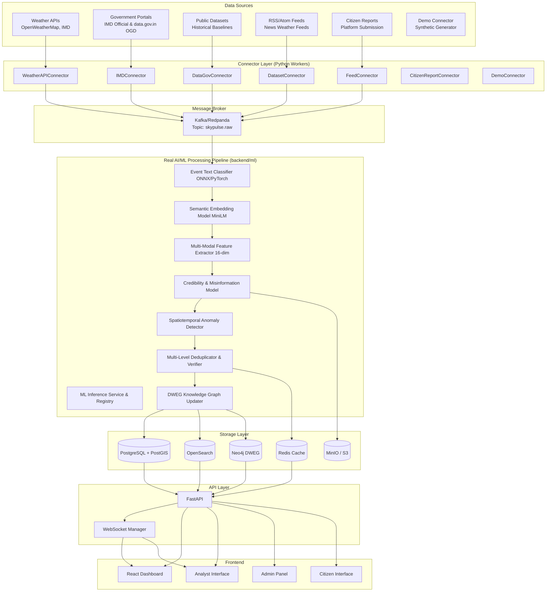
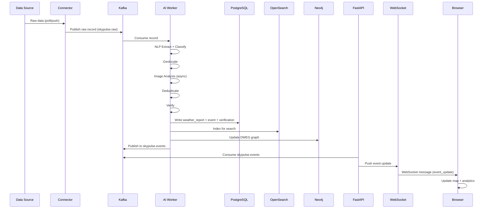
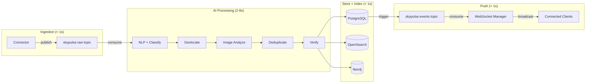
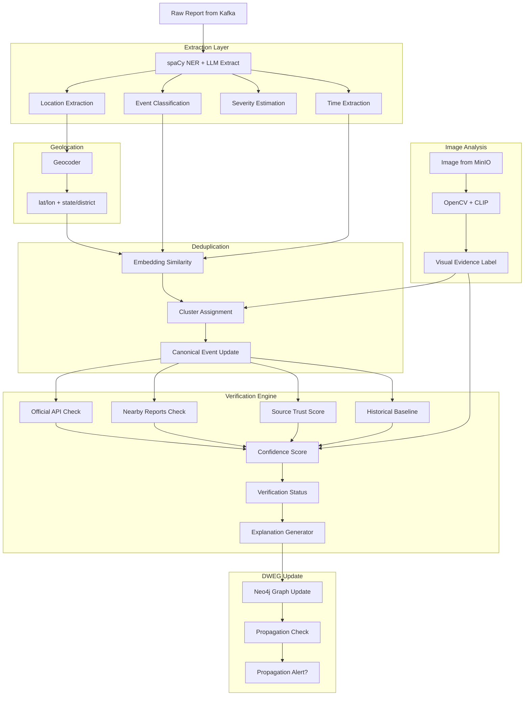
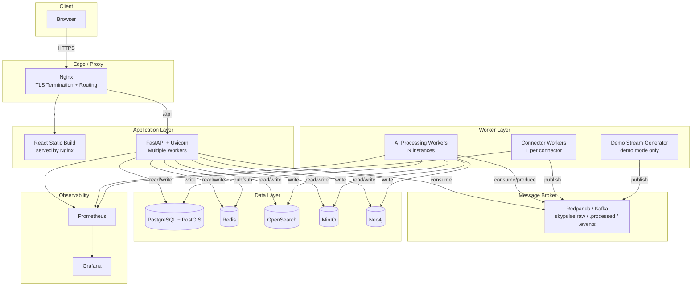

# SkyPulse — System Architecture

**Version:** 1.0  
**Status:** Implementation-Ready

---

## 1. Architecture Principles

1. **Connector-first:** Every data source is a replaceable connector implementing a common interface
2. **Event-driven core:** Data flows through Kafka; no direct DB writes from connectors
3. **AI as middleware:** AI pipeline is a processing stage, not a feature — outputs flow into the same storage layer as manual data
4. **Explainability by design:** Every AI decision is stored as structured evidence, not a black box score
5. **Demo-safe:** The entire platform operates in demo mode with zero external dependencies
6. **No over-engineering:** Technologies are chosen for what the prototype needs today, with clear scaling paths

---

## 2. High-Level Architecture



---

## 3. Technology Stack — Justified

| Technology | Role | Why | Prototype Required? | Scaling Path |
|---|---|---|---|---|
| **FastAPI** | Backend REST + WebSocket API | Async Python, excellent performance, auto-OpenAPI docs | Yes | Add Gunicorn workers; deploy behind Nginx |
| **PostgreSQL 16 + PostGIS 3.4** | Primary relational + spatial database | ACID compliance, mature spatial support, JSON columns for flexible metadata | Yes | Read replicas, table partitioning, PgBouncer |
| **Redis 7** | Cache, session store, pub/sub for real-time | Microsecond reads; pub/sub for WebSocket fan-out | Yes | Redis Cluster for horizontal scale |
| **Kafka / Redpanda** | Message broker | Durable event log; decouples connectors from processors; enables replay | Yes (Redpanda single-node for prototype) | Scale partitions + consumer groups |
| **MinIO** | Object storage for media | S3-compatible; self-hosted for prototype | Yes | Replace with AWS S3 / GCS in production |
| **OpenSearch 2.x** | Full-text search, analytics aggregations | Better suited to weather text search than Postgres full-text at scale | Yes | OpenSearch cluster (3 nodes) for production |
| **Neo4j 5** | DWEG graph database | Native graph traversal for evidence chain and propagation queries | Yes (community edition) | Neo4j Aura managed in production |
| **React 18 + TypeScript** | Frontend | Component ecosystem; strong typing; large talent pool | Yes | CDN static hosting |
| **MapLibre GL JS** | Interactive map rendering | Open-source (Mapbox fork); supports custom tile layers and vector overlays | Yes | Same in production |
| **Redpanda** | Kafka-compatible broker (prototype) | Single binary, no ZooKeeper, faster startup for dev/demo | Yes | Replace with managed Kafka for production |
| **Docker + Compose** | Containerization | Consistent environments; single-command setup | Yes | Kubernetes with Helm in production |
| **Prometheus + Grafana** | Metrics and monitoring | Industry standard; easy Docker integration | Optional for prototype | Same in production |
| **Nginx** | Reverse proxy + static serving | Route /api to FastAPI, / to React build | Yes | Same in production |

**Not used and why:**
- **Apache Spark:** Not needed for prototype volumes. Batch reprocessing can run as Python scripts. Add if ingestion exceeds 1M records/day.
- **Apache Flink:** Real-time stream processing is handled by Python consumer workers. Add for complex stream joins at scale.
- **TailwindCSS:** Vanilla CSS used per project guidelines.

---

## 4. Data Flow Diagram



---

## 5. Real-time Pipeline



**End-to-end p95 target:** < 10 seconds from connector receipt to browser render.

---

## 6. AI / Verification Pipeline



---

## 7. Connector Architecture

All connectors extend `BaseConnector`:

```
BaseConnector
├── poll() → AsyncIterator[RawRecord]
├── parse(raw) → NormalizedRecord
├── health_check() → ConnectorHealth
└── metadata() → ConnectorMetadata

Implementations:
├── WeatherAPIConnector (OpenWeatherMap, WeatherAPI)
├── IMDConnector & IMDHistoricalAdapter (IMD Official API & Gridded NetCDF)
├── DataGovConnector (data.gov.in Open Government Data Platform)
├── RSSFeedConnector (news weather feeds)
├── SocialWebConnector (Social & Web Weather Intelligence)
│   ├── SocialAPIAdapter (Authorized social media APIs with Bearer/API-key auth)
│   ├── RSSAtomAdapter (RSS 2.0 & Atom XML syndication alerts)
│   ├── PublicWebAdapter (Controlled public weather webpages, strict limits)
│   └── PublicJSONAdapter (Configurable JSON REST endpoints)
├── CitizenReportConnector (internal API)
└── DemoConnector (synthetic generator)
```

> **Important Compliance & Access Notice:**  
> Social-media ingestion requires an authorized API/feed or permitted public source. SkyPulse does not bypass platform access controls, solve CAPTCHAs, or implement stealth scraping.

Each connector runs as an independent Python worker process in its own Docker container, publishing to `skypulse.raw` Kafka topic. This allows:
- Independent failure isolation
- Independent scaling
- Hot-swapping connectors without restarting the platform

---

## 8. Deployment Architecture



### Container Services (docker-compose)

| Service | Image | Purpose |
|---|---|---|
| `postgres` | postgres:16-alpine + postgis | Primary DB |
| `redis` | redis:7-alpine | Cache + pub/sub |
| `redpanda` | redpandadata/redpanda | Kafka-compatible broker |
| `minio` | minio/minio | Object storage |
| `opensearch` | opensearchproject/opensearch:2 | Search engine |
| `neo4j` | neo4j:5-community | DWEG graph store |
| `backend` | skypulse/backend | FastAPI application |
| `ai-worker` | skypulse/ai-worker | AI processing workers (scalable) |
| `connector-weather` | skypulse/connectors | Weather API connector |
| `connector-demo` | skypulse/connectors | Demo synthetic connector |
| `frontend` | skypulse/frontend | React static build |
| `nginx` | nginx:alpine | Reverse proxy |
| `prometheus` | prom/prometheus | Metrics collection |
| `grafana` | grafana/grafana | Metrics visualization |

---

## 9. Security Architecture

- **Authentication:** JWT Bearer tokens, issued on login, validated on every protected endpoint
- **Authorization:** Role-based (PUBLIC, CITIZEN, ANALYST, ADMIN, GOVERNMENT) enforced at FastAPI dependency layer
- **HTTPS:** Nginx terminates TLS in production; all inter-service communication inside Docker network
- **Rate limiting:** Redis-backed rate limiting at Nginx and FastAPI layers
- **Secret management:** Environment variables; no secrets in code or images
- **Media security:** Uploads go to MinIO; backend streams to client — no direct public URLs for citizen uploads
- **SQL injection:** SQLAlchemy ORM with parameterized queries throughout
- **XSS:** React JSX prevents by default; API outputs are JSON

---

## 10. Observability

| Signal | Tool | What is monitored |
|---|---|---|
| Metrics | Prometheus + Grafana | Ingestion rate, processing latency, queue depth, error rate, API response times |
| Logs | Structured JSON logs (stdout) | All services log to stdout; collected by Docker logging driver |
| Health | FastAPI `/health` endpoints | DB connectivity, Kafka connectivity, AI model availability |
| Alerts | Grafana alerting | Connector down, queue depth > threshold, error rate spike |

---

## 11. Scalability Strategy

| Component | Prototype | Production Scale |
|---|---|---|
| Connectors | 1 process per connector | Multiple instances behind Kafka consumer group |
| AI Workers | 2–3 instances | N instances based on Kafka consumer lag |
| FastAPI | 1 server, 4 workers | Multiple containers behind load balancer |
| PostgreSQL | Single instance | Read replicas + connection pooler (PgBouncer) |
| Kafka | Single-node Redpanda | Multi-broker Kafka cluster (MSK / Confluent) |
| OpenSearch | Single node | 3-node cluster with dedicated data/master nodes |
| Neo4j | Community single instance | Neo4j Aura Enterprise (managed) |
